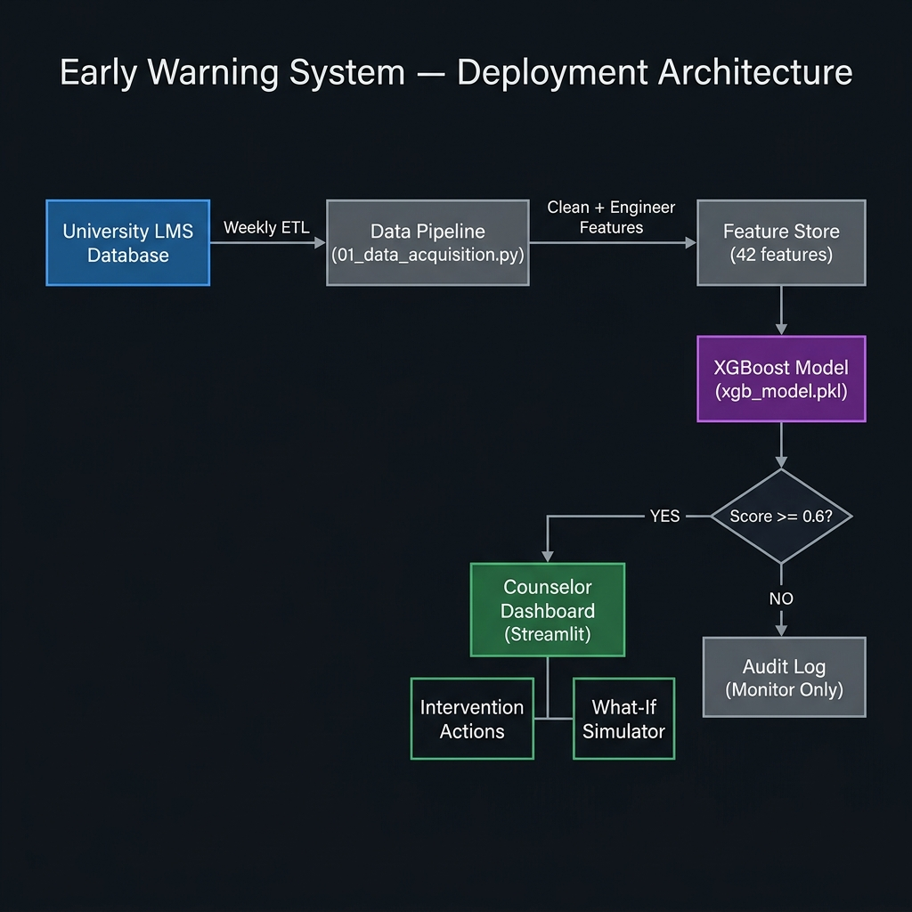
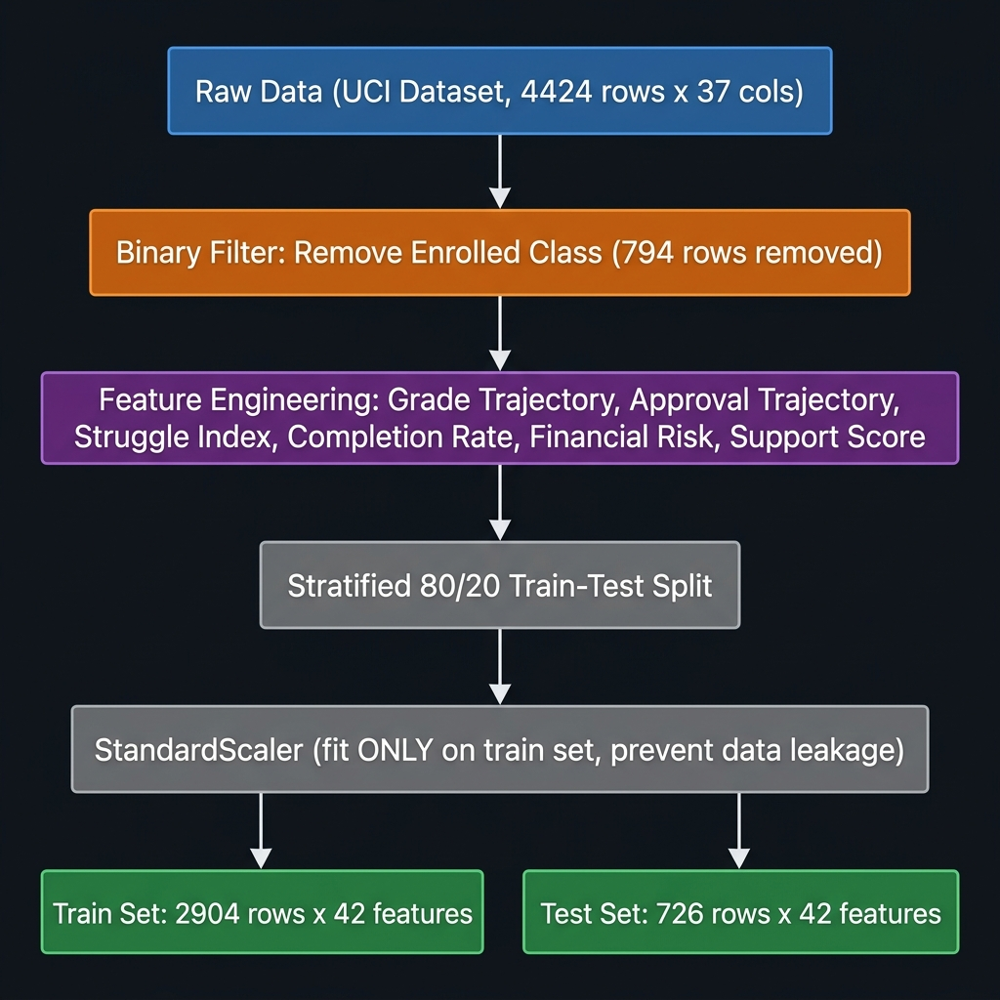

# Early Warning System for Student Attrition

A machine learning system that predicts student dropout risk using the real UCI dataset (ID 697), enabling counselors to intervene before students leave.

**Course:** Machine Learning AAT  
**Dataset:** [UCI ML Repository (ID 697)](https://archive.ics.uci.edu/dataset/697/predict+students+dropout+and+academic+success)  
**Working Mirror:** [Real CSV Dataset URL](https://raw.githubusercontent.com/shivamsingh96/Predict-students-dropout-and-academic-success/main/dataset.csv)  
**Models:** Logistic Regression (baseline) + XGBoost (primary)  
**Dashboard:** Streamlit web application for counselors

---

## Results

| Model | Dropout Recall | Precision | F1 | ROC-AUC |
|---|---|---|---|---|
| Logistic Regression | 0.94 | 0.88 | 0.91 | -- |
| **XGBoost (deployed)** | **0.93** | **0.89** | **0.91** | **0.975** |

93% of at-risk students are correctly flagged before dropout occurs.

---

## Quick Start

```bash
# 1. Create virtual environment
python -m venv code/aat_env
code\aat_env\Scripts\activate        # Windows
# source code/aat_env/bin/activate   # macOS/Linux

# 2. Install dependencies
pip install pandas numpy scikit-learn xgboost==2.1.4 shap matplotlib seaborn streamlit

# 3. Run the pipeline (in order)
cd code
python 01_data_acquisition.py    # Downloads real UCI dataset
python 02_preprocessing.py       # Cleans data + engineers 6 features
python 04_eda.py                 # Generates 7 EDA charts
python 03_model_training.py      # Trains models + generates evaluation plots
python 06_fairness_audit.py      # Runs sub-group fairness audit

# 4. Launch the dashboard
streamlit run 05_dashboard.py
# Open http://localhost:8501
```

---

## Project Structure

```
ML AAT/
|
|-- code/
|   |-- 01_data_acquisition.py      # Downloads real UCI dataset (with fallback)
|   |-- 02_preprocessing.py         # Feature engineering + train/test split
|   |-- 03_model_training.py        # LR + XGBoost training, SHAP, evaluation plots
|   |-- 04_eda.py                   # 7 exploratory data analysis charts
|   |-- 05_dashboard.py             # Streamlit counselor dashboard (5 pages)
|   |-- 06_fairness_audit.py        # Sub-group fairness evaluation
|   |-- aat_env/                    # Python virtual environment
|
|-- data/
|   |-- student_attrition_raw.csv   # Real UCI dataset (4,424 x 37)
|   |-- X_train.csv, X_test.csv     # Preprocessed feature matrices
|   |-- y_train.csv, y_test.csv     # Binary target labels
|   |-- X_test_unscaled.csv         # Unscaled test features (for dashboard)
|   |-- xgb_model.pkl               # Trained XGBoost model
|   |-- scaler.pkl                  # StandardScaler (fitted on train only)
|   |-- fairness_audit.csv          # Fairness audit results
|   |-- eda_plots/                  # All generated charts (15 PNGs)
|
|-- AAT_Final_Submission.md         # Full technical report (9 sections)
|-- README.md                       # This file
```

---

## System Architecture & Data Pipeline

### Deployment Architecture


### Data Preprocessing Pipeline


---

## Dashboard Pages

| Page | Description |
|---|---|
| **Overview** | KPI cards, risk distribution histogram, donut chart, top-15 flagged students |
| **Student Profiles** | Per-student academic/financial breakdown with intervention recommendations |
| **What-If Analysis** | Simulate interventions (change grades, fees, scholarship) and see risk change |
| **Model Insights** | Confusion matrix, PR-AUC curve, feature importance, SHAP, fairness audit |
| **EDA Reports** | 7 exploratory data analysis visualizations |

---

## Feature Engineering

6 features derived from raw UCI data to capture temporal academic momentum:

| Feature | Formula |
|---|---|
| Grade_Trajectory | Sem2 Grade - Sem1 Grade |
| Approval_Trajectory | Sem2 Approved - Sem1 Approved |
| Struggle_Index | Sem2 Approved / (Sem2 Enrolled + 1) |
| Completion_Rate_S1 | Sem1 Approved / (Sem1 Enrolled + 1) |
| Financial_Risk | Debtor=1 OR Tuition Not Paid |
| Support_Score | Scholarship + (1 - Debtor) |

---

## SDG Alignment

**SDG 4 -- Quality Education**: By identifying at-risk students early, the system enables timely intervention, reducing dropout rates and promoting equitable access to education.

---

## Tech Stack

- Python 3.10
- pandas, numpy, scikit-learn
- XGBoost 2.1.4
- SHAP (explainability)
- matplotlib, seaborn (visualization)
- Streamlit (deployment dashboard)
